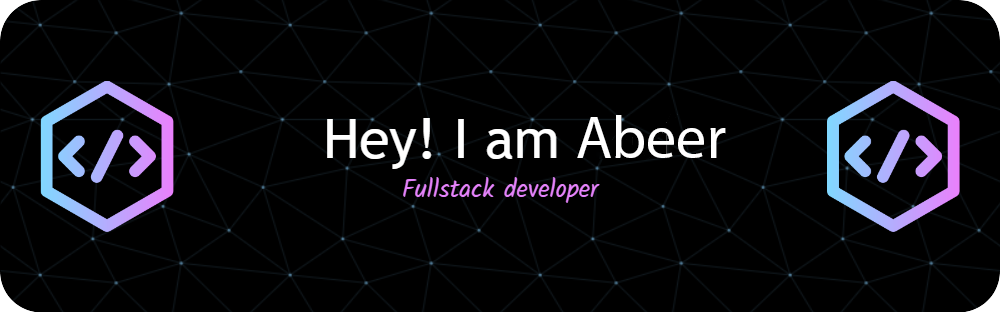

  

Potfolio 👉 ✉️ **abeer.digiservicezone.com** . 😊😊
Email    👉 ✉️ **abeer@digiservicezone.com** . 😊😊

## 🌐 Socials:
      

# 💻 Tech Stack:
                                   

<!-- Snake Game Repo View -->

  

## 🏆 GitHub Trophies

# 📊 GitHub Stats:
 

### ✍️ Random Dev Quote

### 🔝 Top Contributed Repo

---

<!-- Proudly created with GPRM ( https://gprm.itsvg.in ) -->
